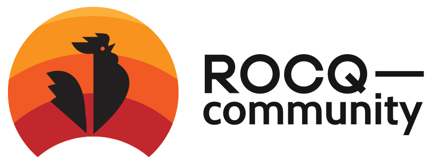

[![Contributing][contributing-shield]][contributing-link]
[![Code of Conduct][conduct-shield]][conduct-link]
[![Zulip][zulip-shield]][zulip-link]

[contributing-shield]: https://img.shields.io/badge/contributions-welcome-%23f7931e.svg
[contributing-link]: https://github.com/rocq-community/manifesto/blob/master/CONTRIBUTING.md

[conduct-shield]: https://img.shields.io/badge/%E2%9D%A4-code%20of%20conduct-%23f15a24.svg
[conduct-link]: https://github.com/rocq-community/manifesto/blob/master/CODE_OF_CONDUCT.md

[zulip-shield]: https://img.shields.io/badge/chat-on%20zulip-%23c1272d.svg
[zulip-link]: https://rocq-prover.zulipchat.com/#narrow/stream/237663-rocq-community-devs.20.26.20users

# [<picture><source media="(prefers-color-scheme: dark)" srcset="./logo-white.svg"></picture>](https://github.com/rocq-community) #

A project for a collaborative, community-driven effort for the long-term
maintenance and advertisement of packages for the [Rocq Prover][rocq-prover].

*Note that this README (the manifesto) is a work in progress and is meant to be
collaboratively improved. Please contribute!*

## Who runs this organization? ##

This organization is run by volunteer Rocq users. Everyone is welcome
(you don't need to be a very experienced Rocq user to participate).
Please [get involved](CONTRIBUTING.md)!

## What are its goals? ##

### Collaborative maintenance of Rocq packages and tools ###

Projects can be hosted in Rocq-community whenever any of the following is the case:

- the initial author has stopped maintaining the project and someone else is
  volunteering to do so;
- the project has become a collective work (several community members are
  actively working on it);
- the initial author is still maintaining the project but they want to
  encourage other community members to participate in the maintenance and
  possibly take over (and the project is indeed raising interest from the
  community);
- the project is a tool of general interest and it makes sense to develop it
  collaboratively.

Each project under the umbrella of Rocq-community has one or several official
maintainer(s), but the maintenance effort is done collaboratively. Users need
not be afraid of volunteering to be the official maintainer of a Rocq-community
project because they can step down at anytime. Changing the maintainer of a
Rocq-community project can be done very easily without the hassle of moving its
location too.

Maintenance is allowed to go much further than just updating the package to
keep it compiling with newer Rocq versions. It can also include refactorization
of the code, uniformization of the style, merging with other packages, taking
pieces out to put them in other libraries, and even removal of some parts that
are not raising sufficient interest. These changes must, nonetheless, always be
done with consideration for compatibility as soon as the package is a library,
plugin or tool that has users.

### Collaborative writing of documentation ###

Some Rocq proofs present a particular pedagogical interest because their
statements are easy to understand, but they require some non-trivial
mathematical tools and their mechanization illustrates interesting proof
patterns, or demonstrate the use of specific libraries. They can be used as
the basis for tutorials which explain the tricks and interesting parts.

Rocq-community hosts several such documentation projects. Among them,
[Hydras & Co.](https://github.com/rocq-community/hydra-battles)
collects libraries of formalized mathematics for inspiration and entertainment,
including detailed documentation and exercises. Your contributions are welcome!

### Advertising interesting packages ###

Not all the packages that are transferred to Rocq-community have the same initial
quality. While this should not stop packages from being taken over, and new
maintainers should strive to improve the package quality, some editorial work
is also required to put forward the most interesting packages, be it for
their usefulness as a library or plugin, because they demonstrate interesting
proof techniques, or because they represent an important achievement.

Currently, the [website](https://rocq-community.org) highlights a selection of
packages with ⭐ and warns about some others with ⚠️ to inform users
that some packages are more recommended for reuse than others.
Come [chat with us][zulip-link] if you want to participate in this
editorial work.

## FAQ ##

### Contributing ###

- **How can I contribute?**

  We have a shared contributing guide, see [CONTRIBUTING.md](CONTRIBUTING.md).
  Some specific projects may have additional contributing guidelines.

- **How to propose a new package?**

  This process is documented [here](https://github.com/rocq-community/manifesto/blob/master/CONTRIBUTING.md#proposing-a-new-package).

- **Can I propose a project of which I am the author?**

  Yes, you can propose a project of which you are the author, as a way of
  preparing to pass on the maintenance to other community members. You can
  start up by proposing yourself as the primary maintainer for this project;
  but if you become less available for this task, we'll be able to pass on this
  role to someone else.

### Position in the Rocq ecosystem ###

- **What is the relation to Rocq's Continuous Integration (CI)?**

  [Rocq's CI][rocq-ci] systematically tests a collection of external libraries
  and plugins for regression and compatiblity breakage with each proposed change to
  Rocq before integration. When a library or plugin in Rocq's CI breaks, Rocq developers
  or contributors will send patches or give instructions how to adapt to the proposed
  change. A [subset][rocq-community-ci] of Rocq-community packages are included in
  Rocq's CI, and the process of fixing such packages that break is straightforward
  since Rocq developers can themselves integrate the required changes.

- **What is the relation to the Rocq package index?**

  The [Rocq package index][package-index] is the present
  way of distributing Rocq packages using [opam][opam]. As such, all packages of
  Rocq-community are meant to be listed in the Rocq package index.

- **What is the relation to the Rocq Platform?**

  The [Rocq Platform][platform] is a continuously developed opam-based distribution of
  Rocq together with a curated selection of generally useful packages. The
  Platform is currently the officially recommended way to install Rocq. To ensure
  that packages are compatible with Rocq over time, Platform package maintainers
  must agree to a form of social contract that, e.g., entails making timely
  releases as Rocq evolves. While a [subset][rocq-community-platform] of Rocq-community
  packages are also part of the Rocq Platform and thus conform to Platform rules,
  Rocq-community packages are not necessarily generally useful or compatible with
  the Platform. To the Rocq Platform, Rocq-community is one organization among many
  that host Platform packages.

- **What is the relation to the Rocq Prover Archive?**

  The [Rocq Prover Archive][rocq-archive] organization contains mainly repositories
  from the old contribs distribution, compatibility testing and maintenance model for Coq.
  There used to be a form allowing users to submit a package that the Coq development
  team would then maintain. While distribution now happens through the Rocq package
  index and compatibility testing is done via Rocq's CI, maintenance of legacy contribs
  is not done regularly.

  Rocq-community is a proposed replacement for the long-term maintenance of
  Rocq packages. Whereas contribs were maintained by the Coq development team,
  Rocq-community is managed by the user community. We encourage users to
  “adopt” a package (including a legacy contrib) and to push the meaning of
  “maintenance” further than simply ensuring that the package continues to
  compile with newer Rocq versions.

### Best practices ###

- **Do the projects of Rocq-community need to have some Continous Integration (CI) setup?**

  Yes, CI plays a big role in keeping code projects more stable over time. In
  the case of a Rocq package, it helps to ensure that the project stays
  compatible with the various versions of Rocq that are claimed to be supported
  (as well as various versions of OCaml in the case of a Rocq plugin).

  Templates for CI and other Rocq-related configuration files are
  maintained in the [templates][templates] repository.

- **Which versions of Rocq must be supported by projects of Rocq-community?**

  At least the last stable version of Rocq must be supported at any given time.
  Support for older versions or the development version of Rocq can be decided
  project by project. Note that supporting the development version of Rocq is
  a requirement to get into [Rocq's CI][rocq-ci], which can be interesting to get
  patches from Rocq developers when they introduce a breaking change (this is
  particularly recommended for plugins).

- **What license to use for a Rocq-community project?**

  The only strict requirement is to use a license that is either
  [approved as an open source license by OSI][osi-approved-license]
  or [considered a free software license by FSF][fsf-free-software-license].
  However, if you create a new project or propose to transfer a project
  of which you are the sole copyright owner, we strongly encourage you
  to (re)license your project under one of the following two licenses:

  - [MIT license](https://choosealicense.com/licenses/mit/): a very
    permissive and popular open source license.  This is the best
    choice if you want to maximize the reusability of your project.
  - [MPL-2.0 license](https://choosealicense.com/licenses/mpl-2.0/): a
    weak [copyleft](https://en.wikipedia.org/wiki/Copyleft) license.
    You can use this license if you want to restrict the license under
    which modified versions of your project may be distributed.  It
    does not limit how larger works may depend on your project.  This
    license should be preferred over the (historically more prevalent)
    [LGPL-2.1 license](https://choosealicense.com/licenses/lgpl-2.1/)
    because it is technically simpler to understand and abide by.

  If neither of these two licenses can be used, we encourage using
  another license that is both approved as an open source license
  by OSI and considered a free software license by FSF.

### Process / organizational aspects ###

- **How to remove a package?**

  When a package loses its interest because a newer, better alternative has
  been found, or for some other reason, the package can be marked as deprecated
  and stop being maintained. We will generally [archive][archived] the
  repository rather than removing it completely though. It also happens that
  we archive a repository because its content has been merged in another one.

- **What kind of permissions do the members have?**

  Members of the Rocq-community organization have write-access to all
  the repositories.  This permission should be used wisely: only minor
  fixes should be pushed without going through pull requests, and pull
  requests should preferably be approved by the project maintainer
  before getting merged.  Some maintainers may decide to protect
  branches to enforce that all changes go through pull requests and
  validate some conditions.  Maintainers are given admin-access on the
  repositories that they maintain.  All members have the permission to
  create or transfer new repositories, but they should only do so
  after going through the [standard
  process](CONTRIBUTING.md#proposing-a-new-package).  At all times,
  there should be exactly three (active) owners of the organization.
  The current owners are Karl Palmskog
  ([**@palmskog**](https://github.com/palmskog)), Pierre Roux
  ([**@proux01**](https://github.com/proux01)), and Théo
  Zimmermann ([**@Zimmi48**](https://github.com/Zimmi48)).

- **What to do in case of conflicts?**

  We will have a governance process to make sure that we can handle conflicts
  that are bound to arise about the management of specific projects. Please
  contribute to [meta-issue #2](https://github.com/rocq-community/manifesto/issues/2)
  which is about this.

### History ###

- **Why this name?**

  The Rocq-community organization takes its inspiration from the similarly-named
  [Elm Community](https://github.com/elm-community).
  Here are some other sister organizations:
  - [OCaml Community](https://github.com/ocaml-community) (officially inspired
    by Elm Community and Rocq-community)
  - [Nix community projects](https://github.com/nix-community)
  - [reasonml-community](https://github.com/reasonml-community)

- **Who made this awesome logo?**

  This logo was designed by Aras from the [openlogos project][openlogos] and
  was attributed to Rocq-community following a general mobilization of users.
  Thanks to Aras and to the 94 people who voted for us to get this logo!

Is anything still unclear? Please [open an issue][meta] or
[chat on Zulip][zulip-link] to ask a question.

[rocq-prover]: https://rocq-prover.org

[osi-approved-license]: https://opensource.org/licenses/alphabetical

[fsf-free-software-license]: https://www.gnu.org/licenses/license-list.html

[rocq-archive]: https://github.com/rocq-archive

[archived]: https://github.com/rocq-community?type=archived

[rocq-ci]: https://github.com/rocq-prover/rocq/blob/master/dev/ci/README.md

[meta]: https://github.com/rocq-community/manifesto/issues/new?template=meta.md

[openlogos]: https://github.com/arasatasaygin/openlogos

[templates]: https://github.com/rocq-community/templates

[package-index]: https://rocq-prover.org/packages

[platform]: https://github.com/rocq-prover/platform

[rocq-community-platform]: https://github.com/search?q=topic%3Arocq-platform+org%3Arocq-community&type=Repositories

[rocq-community-ci]: https://github.com/search?q=topic%3Arocq-ci+org%3Arocq-community&type=Repositories

[opam]: https://opam.ocaml.org
